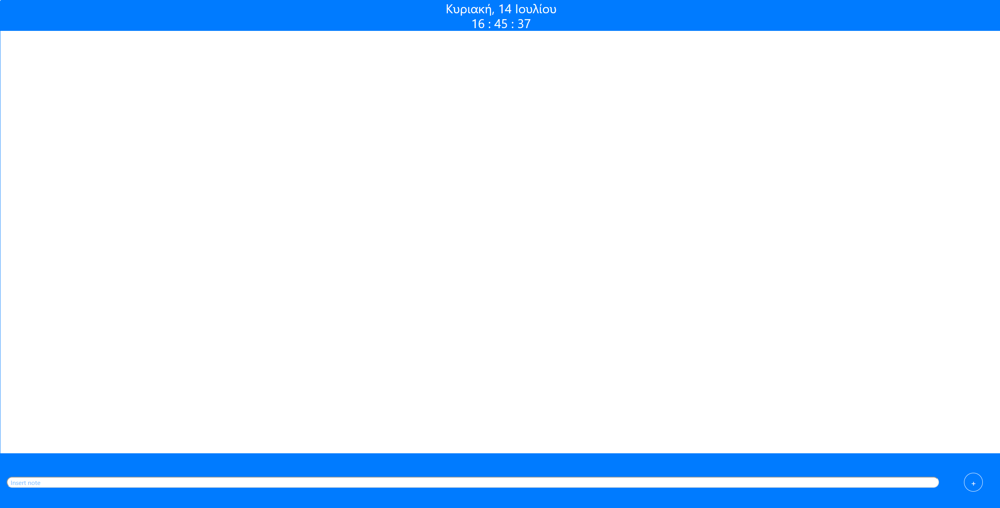
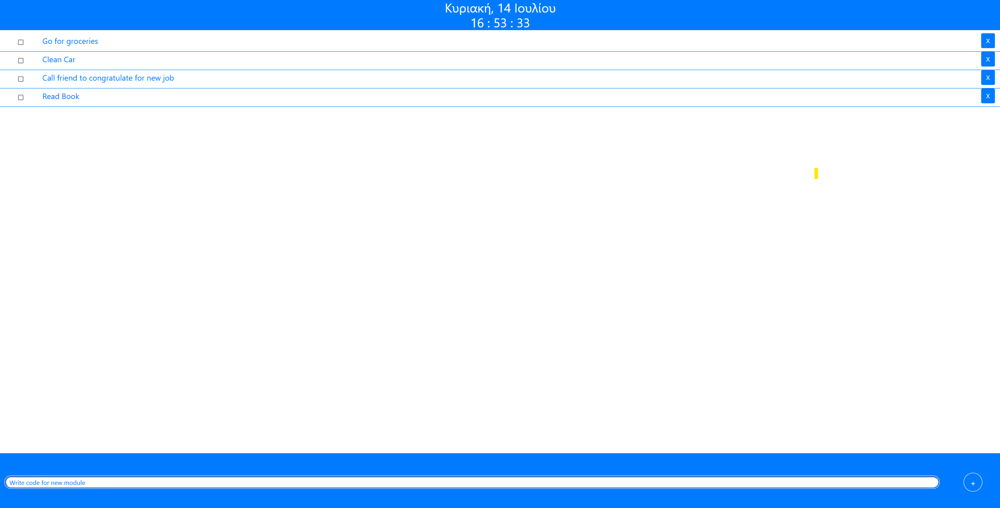
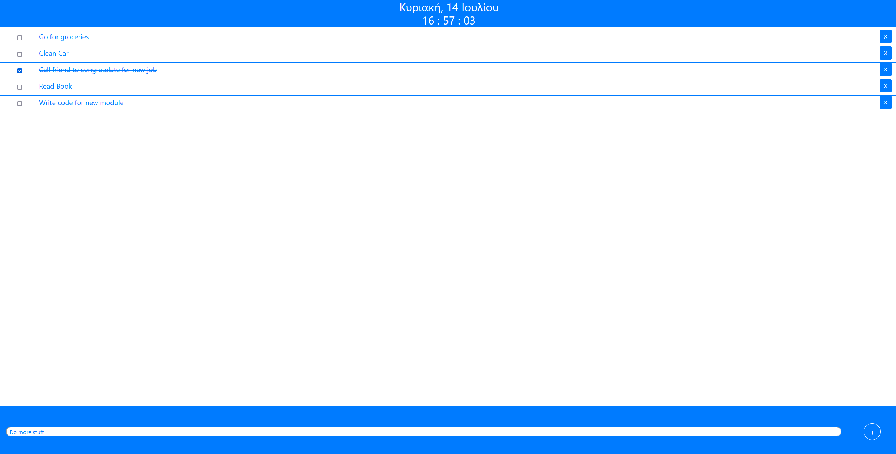

# NotesWebApp 

### A simple WebApp to write notes  

### Download Notes App  

### Open notes.html on your browser  

  

### Keep notes by typing your note in the edit box and presseing ender or clicking on the "+" button  

  

### Delete Notes by clicking the "X" button or mark them as done by checking their check box  

  